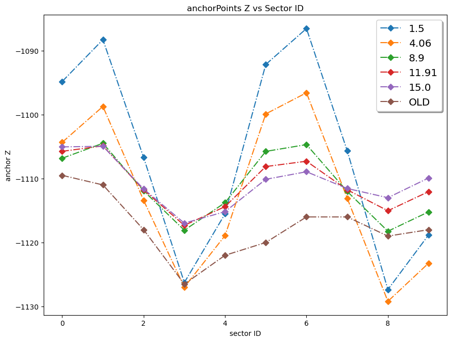

Table of Contents

- [Introduction and TL;DR](#introduction-and-tldr)
- [Installation](#installation)
  - [Bare Metal Installation](#bare-metal-installation)
  - [In a Virtual Environment](#in-a-virtual-environment)
  - [Using the LumiFit Docker/Singularity Container](#using-the-lumifit-dockersingularity-container)
- [Required Config Files](#required-config-files)
  - [Anchor Points](#anchor-points)
  - [assemblyPaths](#assemblypaths)
  - [detectorMaticesIdeal](#detectormaticesideal)
  - [moduleIDtoModulePath](#moduleidtomodulepath)
  - [moduleIDtoSectorID](#moduleidtosectorid)
  - [sectorPahts](#sectorpahts)
  - [sensorIDtoSectorID](#sensoridtosectorid)
- [Deprecated Stuff](#deprecated-stuff)
- [Matrices](#matrices)
- [Jupyter Notebooks](#jupyter-notebooks)
  - [alignCampaing{Box,Modules,Sensors}](#aligncampaingboxmodulessensors)
  - [calculateAnchorPoints](#calculateanchorpoints)
  - [checkExternalMatrices](#checkexternalmatrices)
  - [compareAlignmentMatricesWithMisalignmentMatrices](#comparealignmentmatriceswithmisalignmentmatrices)
  - [Interpreting the residuals matrix](#interpreting-the-residuals-matrix)
  - [generateMisalignmentMatrices](#generatemisalignmentmatrices)
  - [genSenToSectorLut](#gensentosectorlut)
- [Alignment Modules](#alignment-modules)
  - [Utils](#utils)
  - [Data Readers](#data-readers)
    - [lumiPairReader.py](#lumipairreaderpy)
    - [lumiRecoReader.py](#lumirecoreaderpy)
      - [Using the ROOT macros to extract associated recoHits](#using-the-root-macros-to-extract-associated-recohits)
      - [Future Work](#future-work)
    - [lumiTrkQAtoIPReader.py](#lumitrkqatoipreaderpy)
    - [recoCSVReader.py](#recocsvreaderpy)
  - [Sensor Alignment](#sensor-alignment)
    - [Sensor External Matrices](#sensor-external-matrices)
  - [Module Alignment](#module-alignment)
    - [Module External Matrices](#module-external-matrices)
  - [Box Rotation Alignment](#box-rotation-alignment)
- [Closing Words](#closing-words)

# Introduction and TL;DR

This repo contains all that you need to perform software alignment of the Luminosity Detector. It is written in pure python, although for legacy reasons there are also some ROOT macros that are used to generate the input files for the module alignment. Those must be run with PanadaROOT's `root -l -q myMacro.C`.

Nonetheless, the actual alignment requires _no installed ROOT_ as long as all config files are present. The aligners read ROOT files with the [uproot](https://github.com/scikit-hep/uproot5) package, which is a pure python implementation of ROOT's TTree reader and much faster that ROOT itself. The alignment was first written for uproot3 and has been updated to uproot4. It seems the current version is now uproot5, let's just hope this all still works.

Once you have the Lumi\_\*.root files, you can run the alignment with the following command:

```bash
./runAlignment.py -p <pathToData> -t <type> [options]
```

for example, a module alignment campaign could look like this:

```bash
./runAlignment.py \
-t modules \
-p "/mnt/himsterData/roklasen/LumiFit/LMD-15.00-jPzRgtxO/data/reco_uncut/no_alignment_correction" \
--externalMatrices "matrices/100u-case-1/externalMatrices-modules.json" \
--anchorPoints "config/anchorPoints/anchorPoints-15.00-aligned.json"
```

# Installation

The software requires python 3.7 or higher and only three packages:

- awkward (part of the uproot package)
- numpy
- uproot

## Bare Metal Installation

To install these packages, you can use pip:

```bash
pip install -r requirements.txt
```

## In a Virtual Environment

```bash
python3 -m venv alignment-venv
source alignment-venv/bin/activate
pip install -r requirements.txt
```

## Using the LumiFit Docker/Singularity Container

The container image needed to run the [LumiFit Software](https://github.com/panda-luminosity-detector-group/LuminosityFit) already contains the needed packages, so the alignment can also be run in the same container.

```bash
docker run -u $(id -u):$(id -g) \
--net=host -it --rm \
--mount type=bind,source=/path/to/LMD-Alignment,target=/mnt/work/LMD-Alignment \ # this repo
--mount type=bind,source=/path/to/LumiData,target=/mnt/work/LumiData \ # the path where the Lumi_*.root files are
rklasen/lmdfit:miniNov22p1
```

This is a reduced version of the call for LumiFit docker call [described here](https://github.com/panda-luminosity-detector-group/LuminosityFit#new-version-with-docker) (omitting stuff for that's needed for ROOT and ROOTs TBrowser).

Inside, you can then run the alignment as described below.

# Required Config Files

All config files are located in the `config` folder and are pre-generated for the Luminosity Defector as it was in 2023. They provide mapping between geometry paths used by ROOT and sensorID, moduleID and sectorID numbers.

If the geometry changes, these files need to be updated. It is advisable to keep the current ones as blueprints.

## Anchor Points

The anchor points are an extrapolated virtual interaction point if the dipole magnet wasn't there. For details, please find the documentation in [my thesis](https://hss-opus.ub.ruhr-uni-bochum.de/opus4/frontdoor/index/index/year/2022/docId/8586) in chapter 8.6. If the distance of the LMD to the interaction point changes, these anchor points must be updated.

For that you need recoHits files from an _ideal_ geometry (i.e. no misalignments) and the `calculateAnchorPoints.ipynb` notebook. The recoHits files can be generated with the `readRootTrackRecos.C` macro in the `src/ROOT` folder. I'm not entirely sure if this still works, but it should serve as a good starting point.

Alternatively, the `lumiRecoReader.py` in `src/alignment/readers` should work as well.

When plotted as z Position vs. sectorID, the anchor points should look like this:



## assemblyPaths

A dictionary that shows which geometry paths belong to which assembly:

```json
"box": [
    "/cave_1/lmd_root_0"
  ],
  "modules": [
    "/cave_1/lmd_root_0/half_0/plane_0/module_0",
    "/cave_1/lmd_root_0/half_0/plane_0/module_1",
    "/cave_1/lmd_root_0/half_0/plane_0/module_2",
...
```

## detectorMaticesIdeal

The ideal geometry matrices for LMD _without_ misalignment. For details how geometry matrices work, please find chapter 6.2 in [my thesis](https://hss-opus.ub.ruhr-uni-bochum.de/opus4/frontdoor/index/index/year/2022/docId/8586). These matrices are in the `TGeoManager` in PandaROOT once all geometries are added to an `FairRunSim` or `FairRunAna`. They can be written to a json file with the ROOT macro `saveMatricesFromGeomanager.C` in `src/ROOT`. I've written it ages ago and God only knows if it still works. Again, when in doubt, it should provide a good starting point.

**Important**: The matrices are **absolute** matrices from the global coordinate system to the component, i.e. the matrices are not relative to the parent of a component. That means to transform from PandaGlobal to sensor 4 on module 4 on plane 2 on the top half (`"/cave_1/lmd_root_0/half_0/plane_2/module_4/sensor_4"`), you don't need the matrices for the parent components, but only the one matrix for the sensor itself:

```json
"/cave_1/lmd_root_0/half_0/plane_2/module_4/sensor_4": [
    0.9991992951284931,
    -4.899763657267719e-18,
    -0.04000960653046352,
    21.372093283940952,
    0.0,
    -1.0,
    1.2246467991473532e-16,
    1.1615000000000006,
    -0.04000960653046352,
    -1.2236662184894007e-16,
    -0.9991992951284931,
    1127.4174227151334,
    0.0,
    0.0,
    0.0,
    1.0
  ],
```

## moduleIDtoModulePath

Mapping between moduleID and geometry path:

```json
"0": "/cave_1/lmd_root_0/half_0/plane_0/module_0",
"1": "/cave_1/lmd_root_0/half_0/plane_0/module_1",
...
```

## moduleIDtoSectorID

Mapping between moduleID and which sectorID this module is in:

```json
"0": 0,
"1": 1,
"10": 0,
"11": 1,
"12": 2,
"13": 3,
"14": 4,
...
```

There are (or at least there should be) 4 modules in each sector.

## sectorPahts

Mapping between sectorID and _all_ geometry paths of the modules in this sector (so closely related to `moduleIDtoModulePath`):

```json
"0": [
"/cave_1/lmd_root_0/half_0/plane_0/module_0",
"/cave_1/lmd_root_0/half_0/plane_1/module_0",
"/cave_1/lmd_root_0/half_0/plane_2/module_0",
"/cave_1/lmd_root_0/half_0/plane_3/module_0"
],
"1": [
"/cave_1/lmd_root_0/half_0/plane_0/module_1",
"/cave_1/lmd_root_0/half_0/plane_1/module_1",
"/cave_1/lmd_root_0/half_0/plane_2/module_1",
"/cave_1/lmd_root_0/half_0/plane_3/module_1"
],
...
```

## sensorIDtoSectorID

Mapping between sensorID and which sectorID the corresponding sensor is in:

```json
"0": 0,
"1": 0,
"10": 1,
"100": 2,
"101": 2,
"102": 2,
"103": 2,
"104": 3,
...
```

# Deprecated Stuff

The folder `DEPRECATED` contains the old alignment code that was used for my thesis to run > 500 misalignment case studies. It is not maintained or even working anymore because of significant changes in the LumiFit software. It is only kept for reference.

# Matrices

To get started quickly, I've provided one set of misalignment matrices for the LMD (geometry as of 2023) with 100 microns average shift. To see how the numbers were chosen in these matrices, please find chapters 7.1 and 7.2 in [my thesis](https://hss-opus.ub.ruhr-uni-bochum.de/opus4/frontdoor/index/index/year/2022/docId/8586) for the sensors, and chapters 8.1 and 9.1 for modules and the entire box.

They include external matrices (see [Sensor External Matrices](#sensor-external-matrices) and [Module External Matrices](#module-external-matrices)) and the resultant alignment matrices if the PandaROOT simulation used the misaligned geometry and software alignment was performed at 1.5 GeV and 15 GeV.

# Jupyter Notebooks

In the folder `jupyter` there are several Jupiter notebooks that help you to understand the software alignment, generate a set of misalignment matrices, generate anchor points and - most importantly - to compare the found alignment matrices with the misalignment matrices used in the simulation.

## alignCampaing{Box,Modules,Sensors}

The "manual" version of an alignment campaign. While it is not recommended to use this for the actual alignment (rather use the `runAlignment.py` script for that), these are still useful to understand the alignment process for each case.

## calculateAnchorPoints

See [Anchor Points](#anchor-points).

## checkExternalMatrices

Obsolete, external matrices should be generated together with the misalignment matrices.

## compareAlignmentMatricesWithMisalignmentMatrices

Pretty much what it says on the tin. This notebook compares the alignment matrices found by the software alignment with the misalignment matrices used in the simulation. This is done by calculating the residuals matrix for each aligned component (sensor and module alignment) or the Euler angles (box rotation alignment) and printing. For details about residuals matrices, please check chapter 6.5 or 7.10.1 in ... [you know where](https://hss-opus.ub.ruhr-uni-bochum.de/opus4/frontdoor/index/index/year/2022/docId/8586).

## Interpreting the residuals matrix

The results will look something like this (here for sensor 3 on module 0 on plane 0 on the top half):

```text
--------------------------------------------------------:
Path: /cave_1/lmd_root_0/half_0/plane_0/module_0/sensor_3
Residuals Matrix:

[[ 9999.999701    -2.445756    -0.           0.137858]
 [    2.445756  9999.999701     0.          -5.056183]
 [   -0.           0.       10000.          -0.      ]
 [    0.           0.           0.       10000.      ]]
--------------------------------------------------------:
```

This is the homogeneous $4 \times 4$ residuals matrix (see chapter 5.3). Basically, the most important parameters will be the the entries at $m_{14}$ and $m_{24}$, so $0.137858$ and $-5.056183$. The usual units in ROOT are centimeters, but the resultant difference after alignment will be in the order of *micro*meters, so the entire matrix is scaled by `1e4` (thats $10 ^4$ in lazy). That means, the alignment of this specific sensor was off by $1.37858 \mu m$ in $x$ and $-5.056183 \mu m$ in $y$.

The rotation is encoded in the upper left $3 \times 3$ portion of the matix. Usually, ROOT uses degrees for all rotations, but in this case the matrix comes from the software alignment, which uses radians. So the rotation values are always $sin(\alpha), cos(\beta)$ etc with $\alpha, \beta$ being the rotation angles around the Euler angles. These values are also totally important to see if the alignment found the correct rotation, but chances are that the rotation is correct when the translation is correct.

## generateMisalignmentMatrices

Generates sets of misalignment matrices (see chapters 7.1, 8.1 and 9.1 for example numbers). It's very important to generate _sensible_ misalignment matrices, that means matrices that are rigid transformations. You can't just throw random numbers in each entry $m_{11}$ to $m_{44}$ and expect a sensible result. Instead you have to generate real rotation matrices and real translation matrices and combine them to one total rigid transformation matrix. Because $A \cdot B \neq B \cdot A$ for matrices $A$ and $B$, the _order_ matters. You can of course choose any order of rotations and translations that you like, but you should be consistent.

For example, I've always used _first translation, then rotation_ (remember, matrix multiplication order is right to left):

```python
# module matrices follow the same reasoning as sensors,
# but we need also the 1/4th of every transformation for the avg misalign (external matrix)
def genModuleMatrix(avgShift, avgRot):
    shiftVals = np.random.normal(0, avgShift, 2)
    rotVals = np.random.normal(0, avgRot, 1)
    totalTrans = genTransY(shiftVals[1]) @ genTransX(shiftVals[0])
    totalTransQ = genTransY(shiftVals[1]/4) @ genTransX(shiftVals[0]/4)
    totalRot = genRotZ(rotVals[0])
    totalRotQ = genRotZ(rotVals[0]/4)
    return totalRot @ totalTrans, totalRotQ @ totalTransQ
```

The matrices `totalRotQ` and `totalTransQ` are quarter matrices, see [Module External Matrices](#module-external-matrices) for details.

## genSenToSectorLut

Generates some of the config files in the `config` folder. This is valid only for the current geometry, if the geometry changes, you have to write a new version of this notebook. See it as a blueprint.

# Alignment Modules

ALright, this is the real meat of the alignment (or the real tofu if you're vegetarian). The alignment is split into three parts: box, modules and sensors.

Therefore the code is in `src/boxAlignment.py`, `src/moduleAlignment.py` and `src/sensorAlignment.py`.

## Utils

In `src/util/` there are helper functions that are used by all three alignment modules, like to read and save matrices from json to a dictionary with np arrays and vice versa, and the almighty `best_fit_transform()` function that calculates the homogeneous transformation matrix (actually translation vector and rotation matrix, which are assembled to transformation matrices by the aligners) between two point clouds. In the past this was a full-feature ICP algorithm, but I've since removed the iterative part because the assignment between points is already known and doesn't change between iterations, so more iterations won't find different matrices.

## Data Readers

Enabled by Jim Pivarskys excellent [uproot](https://github.com/scikit-hep/uproot5) package, the aligners can read the required ROOT files natively with their respective readers in `src/readers`.

### lumiPairReader.py

This one is required for the Sensor Alignment. It reads `Lumi_Pairs_*.root` files generated by the `PndLmdPairFinderTask` in PandaROOT. In a normal simulation/reconstruction run, this task should be enabled already, so the files should be generated by default. The `PndLmdPairFinderTask` is pretty robust and should work with 1 to 10 tracks per event. For details, check chapter 7.5.

The reader reads these unsorted HitPairs (simulation is event based, so an event can contain a HitPair on any module) and sorts them by the overlapID to numpy files. These numpy files are then read by the aligner.

### lumiRecoReader.py

This one is required for the Module Alignment. It reads `Lumi_recoMerged_*.root` files generated by the PandaROOT reconstruction chain. These files are typically not required after the tracks were reconstructed and back propagated, so they are usually deleted automatically (or not copied from a compute node to permanent storage for MC simulations). In the LumiFit one-button-script, I've added a line to copy these files to a separate folder, so they are available for the alignment. For details, check the [LumiFit Software](https://github.com/panda-luminosity-detector-group/LuminosityFit/blob/8f9866d59cb6f44d5d5162aa5807c8d9c7a1df69/python/runLmdReco.py#L156).

**Important:** Just like the HitPairs for Sensor Alignment, the recoHits are also event based and not sorted. I didn't have time to write a proper recoSortTask or something like that, so the `lumiRecoReader` reads files that are not intended for alignment directly. This itself is not a problem, but since the reader is pretty basic, it only checks if an event has exactly 4 hits (one for each detector plane) and then sorts them in groups of four and by moduleID. **That means this reader only works with 1 (one!) track per event.** More tracks per event will result in more than four recos in an event (on average) and so the reader will skip almost all events.

So, if you want to run with more than 1 tracks per event, you will have to adjust this reader. This is not trivial! You'd basically have to implement some form of track finding like a CA or broken lines fit, and always combine the four recos that would form a valid track.

In the actual experiment, we have very fine grained time stamps, so we actually only expect one track per time stamp on average. Due to the sliding time window I suppose it could happen that that a time stamp contains two reocs from one track and two from a different, but I haven'r run time based simulations, so I haven't dealt with shit like that.

But there is a backup:

#### Using the ROOT macros to extract associated recoHits

Since the PandaROOT Luminosity Fit reco chain includes a track finding stage, a track fitting stage, and a filter stage that discards invalid track candidates, we already have a way to associate recos that belong to the same track. As far as I know these tasks work with more than one track per event, I myself have tested up to 10 tracks per event.

So, therefore I've included a ROOT macro that reads `Lumi_Track_*.root` **and** their associated `Lumi_recoMerged_*.root` ROOT files and only writes recos to a new files that belong to not-rejected track candidate. The macro is in `src/root/readRootTrackRecos.C`.

However, there are several disadvantages here:

- With misalignment, the track finder and track fitters may simply not work correctly. Both of them rely on correct module positions to check what could be a valid track. So if you want to use this, you should probably loosen some cutoffs to allow the fitters to work on misaligned data.
- Ideally, I'd have written a reader that simply mimics this ROOT macro, but I haven't found out how uproot can read TClonesArrays in multiple files _with correct association_. But Jim Pivarksy is a wizard and very friendly, so maybe he can help with that.
- And of course this ROOT macro requires a working PandaROOT installation, with the associated tail of bullshit that comes with it. The containers provided by the LumiFit software help a lot though.

#### Future Work

So if I could put on my magic wizard hat and wish for a feature, it would be a proper recoHits reader (in python, using only `uproot` and `awkward`) that can read the recoHits from the `Lumi_recoMerged_*.root` files with multiple tracks per event. It should include a basic track finder/fitter/filter heuristic with user-settable parameters (to allow for misalignment) and find the correct recoHits for each track. Alas, I haven't found such a hat (yet).

### lumiTrkQAtoIPReader.py

This one is required for the Box Rotation Alignment. It reads `Lumi_TrksQA_*.root` files generated by the Lumi QA task in PandaROOT. These files are always available, since they are also needed by the Luminosity fit. They contain the back propagated tracks from the LMD to the IP, so getting an interaction point from these files is trivial. Just read a few ten thousand tracks and average the interaction points.

### recoCSVReader.py

This is the reader for the recoHits CSV files generated by the `readRootTrackRecos.C` macro. It should be a drop-in replacement for the `lumiRecoReader.py`, but I haven't tested that yet.

## Sensor Alignment

The actual sensor alignment logic. For details, read chapter 7 (or only 7.3 if you're impatient). The math is convoluted, but not complicated.

### Sensor External Matrices

Sensor alignment can only inter-align the sensors on a module. That means it can give the positions of all sensors on a module _relative to one chosen sensor_, but not relative to the module they're all on. Technically it doesn't matter which sensor you choose as reference, but sensor 0 is directly in a corner of a sensor module. So this one would be easiest to align w.r.t. to the module for example via microscope. Sensors 0 and 1 can't be inter-aligned because there is no overlap between them, but it should be possible to get sensors 0 and 1 on one silicon wafer as a single chip, so if we know where 0 is, we also know where 1 is.

Because of that, these two are chosen as reference sensors for all others on a sensor modules. And because they can't be found by alignment, but are are still _needed_ by the alignment, they have to be supplied as external matrices to the sensor alignment. That's why they're called external matrices. But because they are no more special than any other sensor misalignment matrix, they are really only the offset of the sensors 0 and 1 from their design position in the module frame of reference. Those are easy to determine with a microscope.

For example, if sensor 0 on module 0 on the first plane in the top half is **exactly** where it's supposed to be, the external matrix for it is the identity matrix $\mathrel{1}$ (because this matrix is only the deviation from the design position):

```json
"/cave_1/lmd_root_0/half_0/plane_0/module_0/sensor_0": [
    1,
    0.0,
    0.0,
    0.0
    0.0,
    1.0,
    0.0,
    0.0,
    0.0,
    0.0,
    1.0,
    0.0,
    0.0,
    0.0,
    0.0,
    1.0
  ],
```

By the way, if later it's found that some other sensors are better suited as external references, the entire math in chapter 7.4 and A.3 to A.11 has to be redone. Again, it's not complicated, but it's, like, just. so. much. math. I certainly won't be doing that.

## Module Alignment

See chapter 8.3. The idea is deceptively simple, but there are a few traps here. First, just like in the sensor case, the module alignment can only align the modules relative to each other in a sector, but not relative to other sectors or the box. For that, additional measurements are needed. Secondly, there are global transformations that module alignment cannot eliminate, for details see chapter 8.5. Shearing and gobal rotation can in part be eliminated with the anchor points.

### Module External Matrices

What remains is the average misalignment of all four modules in a sector. This is completely analogous to the sensor alignment case, in that we would need to know the position of one module in the sector to align the other three to it. But in contrast to the sensor alignment, here there is no easily accessible module that we can use as reference. Instead, I'm employing an average misalignment of all four modules. In the real detector, we'll have capacitive distance sensors that measure the position and orientation of the entire half detector (lower and upper half independently). But because these details weren't fleshed out yet, I'm trying to model this a different way.

Suppose we know the positions of all four modules in a sector with respect to each other, but not to the box. We can then treat this sector as one solid object. This object will have a center of mass (or center of volume, doesn't really matter) that is offset from where it would be if the modules were perfectly aligned (the same goes for the orientation). This offset is the average misalignment of the modules in the sector. If we know this offset, we can align the modules to it. My argument is now that this total offset of the entire sector is caused by the sum of each contributing module misalignment times a factor of $\frac{1}{4}$. That means each module contributes one fourth of the misalignment of the sector.

Now, because the details of how the capacitive sensors are arranged weren't known when I wrote this, the details of how to map their data to this average misalignment are still open and must be implemented in the future.

To generate these averages programmatically during the generation of the misalignment matrices, I've added the quarter matrices here:

```python
# module matrices follow the same reasoning as sensors,
# but we need also the 1/4th of every transformation for the avg misalign (external matrix)
def genModuleMatrix(avgShift, avgRot):
    shiftVals = np.random.normal(0, avgShift, 2)
    rotVals = np.random.normal(0, avgRot, 1)
    totalTrans = genTransY(shiftVals[1]) @ genTransX(shiftVals[0])
    totalTransQ = genTransY(shiftVals[1]/4) @ genTransX(shiftVals[0]/4)
    totalRot = genRotZ(rotVals[0])
    totalRotQ = genRotZ(rotVals[0]/4)
    return totalRot @ totalTrans, totalRotQ @ totalTransQ
```

This literally just generates a matrix that has one fourth of the shift and one fourth of the rotation of the total misalignment matrix. I'm collecting these four quarter matrices for each sector and multiply them together. The result is the average misalignment matrix for the sector. It must be done this way, because you can't really multiply or divide rigid transformation matrices with a scalar and still get a valid rigid transformation matrix. But simply applying all four quarter matrices in sequence works quite well. Technically, the order is important too, because matrix multiplication is not commutative, but I've found that the order doesn't matter here because all individual matrices are rather close to the identity matrix.

```python
misalignModules = {}
misalignModulesQ = {}
externalMatricesModules = {}
for path in allPaths["modules"]:
    misalignModules[path], misalignModulesQ[path] = genModuleMatrix(avgShiftInCM, avgRotInDeg)

# gen external matrices
for key, value in sectorPaths.items():
    thisExternalMatrix = np.eye(4)
    for path in value:
        thisExternalMatrix = thisExternalMatrix @ misalignModulesQ[path]
    externalMatricesModules[key] = thisExternalMatrix


saveMatrices(misalignModules, "../output/misMat-modules.json")
saveMatrices(externalMatricesModules, "../output/externalMatrices-modules.json")
```

## Box Rotation Alignment

This is thankfully quite easy, both conceptually and math-speaking-ly. See chapter 9.2, but the gist is:

Say you're looking at a point very far. You set your frame of reference such that your "forward" points directly to that point. Now someone else comes along and says "Oh I know that point. In the RealWorldFrameOfReference™, it's at 45 degrees to the left". Then you know that your frame of reference is rotated by 45 degrees to the left w.r.t. the RealWorldFrameOfReference™ (as long as the origins of both frames are in the same place). Extend that to two dimensions and you basically have the math for the box rotation alignment.

The point "we" are seeing is the reconstructed interaction point as it is seen from the LMD. The RealWorldFrameOfReference™ is the global coordinate system of the PANDA experiment. Because the rest of the experiment also has a reconstructed interaction point, and with very high precision, we can rotate the Lumi Box such that "their" interaction point is in the same place as "ours". We rotate about the center of mass of the Lumi Box, because offsets in any directions are insignificant compared to the rotation. And that's basically it.

So there is no need for external matrices or anchor points here. There are still some free parameters however, which are very important:

- The position of the interaction point determined by the rest of the PANDA experiment. I've hard-coded it to (0,0,0) in the aligner for now, but it should be read from a file. Someone should add that code
- The distance of the LMD to the interaction point. Well actually the entire position, distance and rotation, of the LMD inside the PANDA frame of reference. This is pretty easy though, since this matrix is known by design. In the code, it's the ideal transformation matrix to the frame "/cave_1/lmd_root_0". It's in the `detectorMatricesIdeal` config file by default.

# Closing Words

So this has been basically a brain dump of all the stuff I've done for the LMD alignment. I hope it's useful to someone. If you have any questions, please feel free to contact me, even if I'm no longer working on the LMD. I'm always happy to help. I really liked working for Miriam and PANDA as a whole and I'm really gonna miss it. But life moves on and must I.
